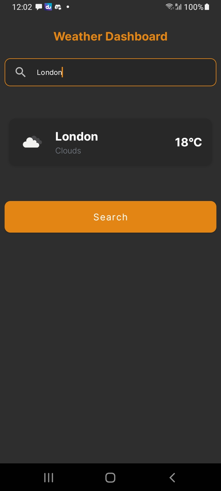

## About Weather Dashboard

Weather Dashboard showcases:
- MVVM & Clean architecture
- Search the weather of any city
- Displays Weather Icon, City Name, Weather condition, Temperature, Weather condition description
- Last searched City persistence
- Clean and modern UI

## Decisions & Trade-offs
- Used XML for UI to best focus on the Separation of concerns and clean code. I can work with Compose as well, but more experienced and an expert in XML
- Wanted to use Room for data persistence, but dropped the idea to focus on what is required in the assignment within in time constraint.

## If I had more time
- Would use the recommended api for weather using Lat Lng because by city name is deprecated. Mostly if working on a real-world app.
- Would use Room for data caching 
- Would use Jetpack Compose for UI.
## The Answer of 7/6
Z.ZZZ4Z4Z4Z4Z4Z4Z4Z4Z4

## How to run

1. Download the repository
2. Unzip the project folder
3. Open the project in Android Studio.
4. Build and run the app on your preferred device or emulator.

## Tech Stack

**Core Technologies:**
- **Kotlin**
- **MVVM & Clean Architecture**
- **Kotlin Flows & State Flows**
- **Material Design 2**
- **Coil** for image loading
- **Retrofit** for network requests
- **Moshi** for JSON parsing
- **Hilt** for dependency injection
- **Jetpack Navigation Component**
- **KSP** (Kotlin Symbol Processing)

**Testing Tools:**
- **JUnit4** for unit testing
- **Coroutine Testing Library** for coroutine-based code
- **MockWebServer** for simulating network responses
- **MockK** for mocking
- **Robolectric** for Android component testing
- **Jetpack Navigation Tests**

## Screenshot

 

